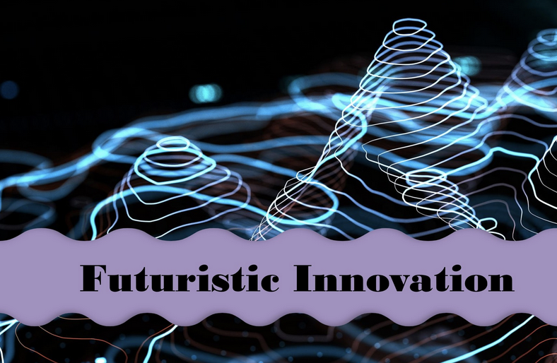

# Deep Learning DNA: Surviving Architectures and Profound Principles

[](https://github.com/your-repo/dldna)  


**Uncover the Evolutionary Path of Deep Learning - From Foundational Concepts to Cutting-Edge Multimodal AI**

This repository is the companion to the book "Deep Learning DNA: Surviving Architectures and Profound Principles". It provides the online, interactive version of the book (currently up to Chapter 11, Part 1), including source code and rendered Quarto output. We go beyond a typical textbook or tutorial. This book is a journey through the *evolution* of deep learning, revealing the core principles that have driven its incredible progress. We don't just explain *what* these technologies do; we explore *why* they work and *how* they came to be.

**What Makes This Book Unique?**

*   **Evolutionary Perspective:** We trace the lineage of deep learning architectures, like biologists studying the evolution of a species.  You'll understand not just the *what*, but the *why* and *how* of each major breakthrough, from the 1943 McCulloch-Pitts neuron to 2025's multimodal models.  We highlight the challenges researchers faced, the problems they aimed to solve, and the connections between successive innovations.
*   **Focus on the "DNA":**  We identify the core, enduring principles – the "DNA" – that underlie the vast and rapidly changing landscape of deep learning. This approach helps you navigate the field's complexity and anticipate future developments.  It's about understanding which ideas are likely to *survive* and form the foundation of AI's future.
*   **Depth and Clarity:** We provide concise yet in-depth explanations of key concepts, striking a balance between mathematical rigor and intuitive understanding. Unnecessary details are omitted to keep the focus on the essential principles.
*   **Cutting-Edge Coverage:** We cover the latest advancements (up to 2025), including Retentive Networks, Mixture of Experts, and advanced Multimodal Architectures. You'll be at the forefront of deep learning's evolution.
*   **Bridging Theory and Practice:**  We combine practical code examples (often with advanced implementations suitable for real-world use) with mathematical insights, enabling you to both *use* and *understand* these powerful techniques.
* **Advanced Examples:** We go far beyond toy examples, providing code that is designed for use.

**What You'll Explore (Part 1, Chapters 1-11):**

*   **The Foundations (Chapters 1-3):**  From Hebbian learning and the perceptron to the mathematics of deep learning (linear algebra, calculus, probability, information theory) and essential frameworks like PyTorch and Hugging Face Transformers.
*   **Core Components (Chapters 4-6):**  A deep dive into activation functions, optimization algorithms (including modern optimizers like Lion and Sophia), parameter initialization, and techniques for combating overfitting (regularization, dropout, batch normalization).  We also explore hyperparameter optimization.
*   **Convolutional Neural Networks (Chapter 7):**  The evolution of CNNs, from basic convolutions to ResNet, Inception modules, and EfficientNet.  We cover the principles of feature extraction and the shift towards efficient model scaling.
*   **The Transformer Revolution (Chapters 8-9):**  A comprehensive exploration of the Transformer architecture, its origins in sequence processing, and the critical role of attention mechanisms. We delve into self-attention, multi-head attention, positional encoding, and the encoder-decoder structure.  Chapter 9 focuses on *efficient* Transformers, covering techniques like FlashAttention, Grouped-Query Attention (GQA), Sliding Window Attention (SWA), RoPE (Rotary Positional Embeddings), and models like Mistral and Phi-3. We examine PagedAttention and continuous batching.
*   **Multimodal Deep Learning (Chapters 10-11):**  The frontier of AI!  We explore models that integrate multiple modalities (text, images, audio, etc.), covering early approaches like image captioning and visual question answering (VQA), as well as groundbreaking architectures like CLIP and ViT (Vision Transformer). We delve into various fusion strategies, cross-modal attention, and the principles of contrastive learning.

**Interactive Learning:**

Many chapters include interactive Jupyter Notebooks that allow you to experiment with the concepts, modify code, and visualize the results.  This hands-on approach solidifies your understanding and empowers you to apply these techniques in your own projects.

**Book Structure:**

The book is structured in two parts:

*   **Part 1: Deep Learning DNA (Chapters 1-11):**  Focuses on the foundational architectures and enduring principles.  This part is currently available in this repository.

Get ready to decode the DNA of deep learning!
*   **Part 2: "Frontiers of Deep Learning"** (Coming Soon) - This part will explore advanced topics and cutting-edge applications, including:
    *   Building powerful Small Language Models (SLMs).
    *   Self-driving cars and other autonomous systems.
    *   Protein structure prediction (like AlphaFold).
    *   And more!

## Getting Started:

This repository is structured to mirror the book's organization. You can navigate the content in several ways

*   **Clone the Repository:**  The best way to experience the material is to clone this repository to your local machine

    ```bash
    git clone [https://github.com/your-repo/dldna.git](https://www.google.com/search?q=https://github.com/your-repo/dldna.git)  # Replace with your actual repo URL
    cd dldna
    ```

*   **Install Packages**

    ```bash
    cd dldna
    pip install -r requirements.txt
    ```

*   **Run Locally (Recommended):** After cloning, you can easily serve the notebooks locally using Python's built-in HTTP server. This allows you to interact with the code and modify it as you go.  From the `dldna` directory (the root of the cloned repository)

    ```bash
    python -m http.server
    ```

    Then, open your web browser and go to `http://localhost:8000/`. You may see `index.html` there, if not just navigate to `/notebooks/ko/` (or `/notebooks/en/` for English version) and any ipynb files.


*   **Browse Online:** (If applicable) If you are hosting the rendered notebooks online (e.g., using GitHub Pages, Quarto Pub, etc.), provide a link to the online version here. *Note:* If you're just using `python -m http.server`, you *won't* have a public online version.

## Repository Structure:

The repository is organized as follows:

```
dldna/
├── notebooks/      <-- Jupyter Notebooks (rendered book content)
│   ├── ko/         <-- Korean Version
│   │   ├── part_1/
│   │   │   ├── 01_딥러닝의 시작.ipynb
│   │   │   ├── ...
│   │   │   └── 11_...ipynb   <-- Up to Chapter 11
│   │   └── ...
│   └── en/         <-- English Version
│       ├── part_1/
│       │   ├── 01_The Start of Deep Learning.ipynb
│       │   ├── ...
│       │   └── 11_...ipynb   <-- Up to Chapter 11
│       └── ...
├── dldna/        <-- Source code for the book (Python scripts, etc.)
│    ├── chapter_01/
│    │   ├── ...
│    ├── chapter_09/
│    │   ├── simple_phi3.py
│    │   └── ...
│    └── ...
├── assets/         <-- Images and other assets
│   └── images/
│        └── book_cover_03.png
├── .gitignore
├── .gitattributes
├── LICENSE
└── README.md       <-- This file
```

*   **`notebooks/`:** Contains the rendered Quarto book content as Jupyter Notebooks (`.ipynb` files), organized by language (Korean: `ko`, English: `en`) and part/chapter.
*   **`dldna/`:** Contains the source code (primarily Python scripts, `.py` files) used in the book, organized by chapter.
*   **`assets/`:** Contains images and other assets used in the book.

---
## License

This work is licensed under a Creative Commons Attribution-NonCommercial 4.0 International License (CC BY-NC 4.0).  See the [LICENSE](LICENSE) file for details.

## Contact

For inquiries, please contact: seanpark0917@google.com

